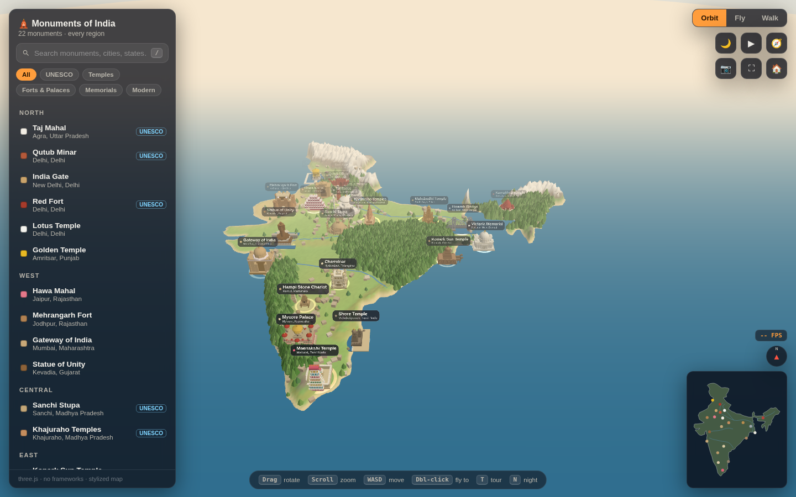
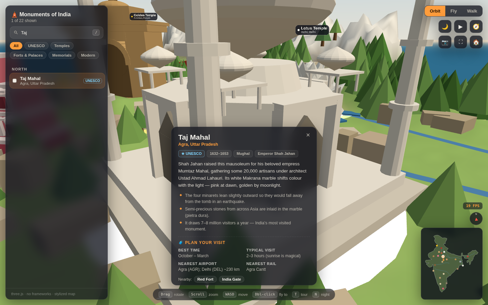
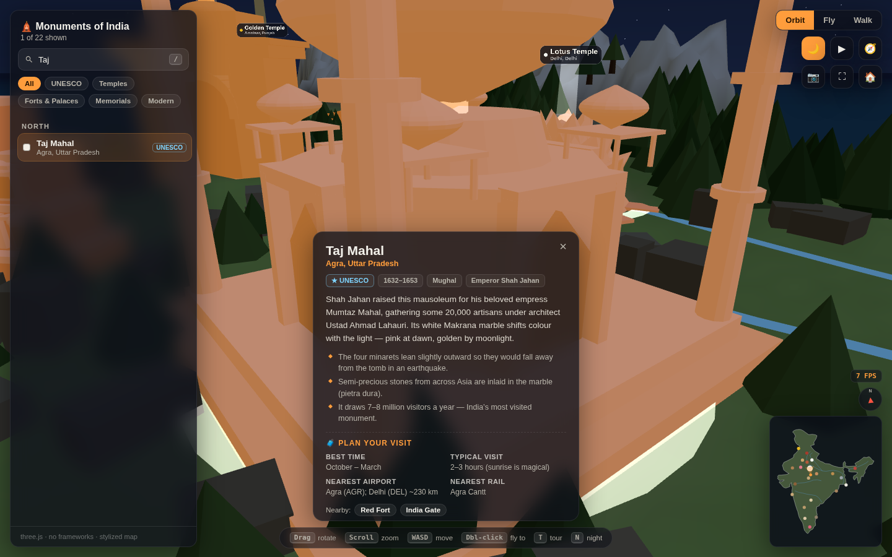
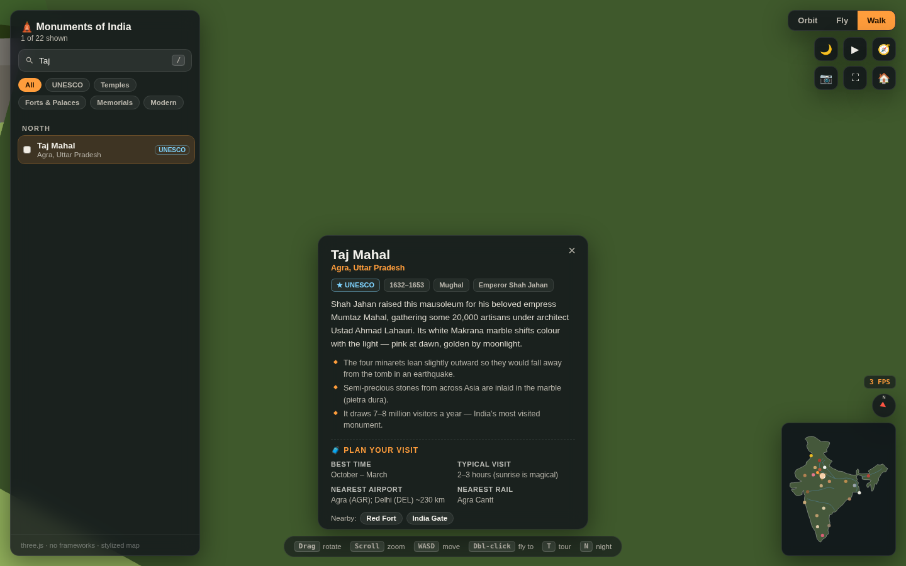
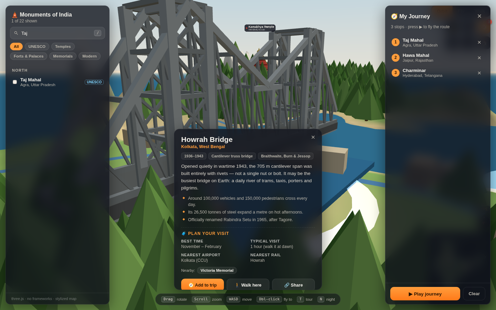

# 🛕 Monuments of India — 3D Atlas

A game-style, low-poly **3D map of India** you can fly, walk and search across —
built to explore the country's most famous monuments, learn their stories, and
help plan a trip. Twenty-two landmarks stand as recognizable models at their
real geographic locations; zoom to a glowing, name-labelled site to read its
history and travel tips right on the map.

Pure static site — **three.js, no build step, no frameworks, zero runtime
network calls**. Runs from any static server and on GitHub Pages.



## ✨ Features

- **A stylized 3D India** — hand-authored coastline with proportionate mountain
  ranges (Himalayas, Western & Eastern Ghats, Aravallis, Vindhyas, Northeast
  hills), forest cover across the country's wooded regions (Western Ghats,
  Northeast, central India, the Terai and the Sundarbans), the Thar desert, the
  Deccan plateau, and the Ganga, Yamuna, Brahmaputra, Godavari & Narmada rivers,
  afloat in an animated ocean.
- **22 famous monuments**, each a low-poly model with a recognizable silhouette
  (Taj Mahal, Qutub Minar, Golden Temple, Hawa Mahal, Konark's chariot wheels,
  Meenakshi's rainbow gopuram, Statue of Unity, Howrah Bridge, and more).
- **Three camera modes** like a proper city explorer — **Orbit**, **Fly**
  (WASD + mouse-look), and **Walk** (a ground-level stroll around a site).
- **Search & browse** from the left panel: filter instantly by name, city, or
  state; jump by region; filter chips for UNESCO / Temples / Forts / Memorials.
- **Cinematic fly-to** — double-click a monument, pick it from the list, or tap
  its minimap dot to swoop in on a smooth arc that clears the terrain.
- **On-map info cards** with history, quick facts, a UNESCO badge, and a
  **“Plan your visit”** block: best months, nearest airport & railhead, typical
  visit duration, and clickable nearby monuments.
- **Guided tour** (the *Golden Route*) that flies you monument to monument.
- **Plan a trip — “My Journey”** — add monuments to a saved itinerary and the map
  draws glowing flight-path arcs between your stops (with connectors on the
  minimap); press ▶ to fly the whole route. Your trip is saved in the browser.
- **Shareable deep links** — every monument has its own URL (e.g. `…/#taj-mahal`);
  the **🔗 Share** button copies it (and uses the native share sheet on phones),
  and opening a link flies you straight there.
- **Day / night** — at night the sky deepens, stars come out, and every
  monument is floodlit, just like the real ones.
- **Minimap, compass, FPS, toasts** and a controls legend round out the HUD.

## 🚀 Run it locally

No dependencies, no build. Serve the folder with anything:

```sh
# option 1 — Python
python3 -m http.server 8000

# option 2 — Node
npx serve .
```

Then open <http://localhost:8000>. (Opening `index.html` via `file://` will not
work — ES modules require an `http(s)://` origin.)

## 🎮 Controls

| Action | Control |
| --- | --- |
| Rotate / zoom / pan | **Drag** · **Scroll** · **Right-drag** |
| Visit a monument | **Double-click** it, or pick it from the list / minimap |
| Move (Fly / Walk) | **W A S D**, **Q/E** up-down (Fly), **Shift** to boost |
| Camera modes | **1** Orbit · **2** Fly · **3** Walk |
| Search | **/** or **Ctrl/⌘ K** |
| Guided tour | **T** (**Space** to skip a stop) |
| My Journey (trip planner) | **J**, or the 🧭 button |
| Day / night | **N** |
| Overview / reset | **H** · **Esc** closes cards & exits the tour |
| Fullscreen · Screenshot | **F** · 📷 button |

**On phones / touch:** it's fully touch-friendly — **drag** to look, **pinch** to
zoom, **tap** a monument to visit it, and use the **☰** button for the searchable
list (it slides in as a drawer). In **Fly / Walk** modes an on-screen **joystick**
appears for movement while you drag to look around. The layout adapts to portrait
and landscape, and the info panel becomes a bottom sheet.

## 🗺️ The 22 monuments

**North** — Taj Mahal · Qutub Minar · India Gate · Red Fort · Lotus Temple ·
Golden Temple
**West** — Hawa Mahal · Mehrangarh Fort · Gateway of India · Statue of Unity
**Central** — Sanchi Stupa · Khajuraho Temples
**East** — Konark Sun Temple · Victoria Memorial · Howrah Bridge · Mahabodhi Temple
**Northeast** — Kamakhya Temple
**South** — Charminar · Meenakshi Temple · Hampi Stone Chariot · Mysore Palace ·
Shore Temple

## 📸 More views

| Fly to a monument | Night mode | Walk the grounds |
| --- | --- | --- |
|  |  |  |

| Plan a trip — “My Journey” with route arcs on the map |
| --- |
|  |

## 🌐 Deploy to GitHub Pages

A workflow (`.github/workflows/deploy-pages.yml`) publishes the repo as-is on
every push to `main`. One-time setup: in the repo's **Settings → Pages**, set
**Source** to **GitHub Actions**. All asset paths are relative, so the site
works correctly from the project subpath (`…/monument-3d-game/`).

## 🛠️ How it's built

- **three.js r180** is vendored in `vendor/` (module + core + license) with an
  import map — nothing is fetched at runtime.
- **`data/india-geo.js`** holds the projection and the hand-authored coastline,
  ridges and rivers; **`data/monuments.js`** holds all monument facts & trip data.
- **`js/models/`** builds each monument from a small primitive kit (domes,
  minarets, gopuram tiers, chariot wheels…), merged to one mesh per monument
  sharing a single flat-shaded material.
- Custom camera rig, fly-to tween, canvas-sprite labels, and a 2D-canvas
  minimap — **no three.js addons**.

## 📝 Notes

- The map is a **stylized illustration**, not a survey map — coastlines,
  distances and monument sizes are exaggerated for readability and fun.
- Monument facts are for general education; check official sources for exact
  visiting hours and travel details before planning a trip.

## 💡 Ideas for later

Hindi / localized text, real photos, a monuments quiz mode, higher-detail glTF
models, state boundaries, and exporting a planned journey as a shareable link.

## License

MIT — see [LICENSE](LICENSE).
